# 🚀 AWS Codepipeline using Terraform and Shell scripting for Deployment

This project demonstrates first how to **provision infrastructure on AWS using Terraform**. Second use **AWS codepipeline** to automate the process of building the infrastructure and deploy a web page that will be accessible throught a load balancer. It’s a hands-on DevOps project showing Infrastructure as Code (IaC) and automation via a CI/CD tool.

---

## 📂 Project Structure

   ```
├── application/
    ├── scripts/
        ├── install_dependencies.sh
        ├── start_server.sh
    ├── appspec.yml
    ├── index.html
├── environments/
    ├── dev.tfvars            # All dev environment variables value
    ├── prod.tfvars           # All pro environment variables value
├── images/                   # All images that will be display
├── infrastructure/
    ├── main.tf               # Alb, Sg, LT ... configuration resources 
    ├── providers.tf          # AWS provider configuration
    ├── variables.tf          # Define all input and changable arguments
    ├── vpc.tf.               # vpc configuration resources 
    ├── terraform.tfvars      # Value of all differents variables
    ├── outputs.tf            # List of all output that can be use 
    ├── user_data.sh          # Initialize and install web page
├── pipeline/
    ├── codedeploy.tf         # Codedeploy configuration 
    ├── iam_roles.tf          # codebuild & codepipeline role resources
    ├── main.tf               # codebuild & codepipeline configuration
    ├── providers.tf          # AWS provider configuration
    ├── variables.tf          # Define all input and changable arguments
    ├── terraform.tfvars      # Value of all differents variables
    ├── outputs.tf            # List of all output that can be use 
    ├── S3bucket_artifacts.tf # Bucket to store all artifacts
    ├── buildspec-app.yml     # Deployment script for the application  
├── scripts/
    ├── deploy-infrastructure.sh   # Set of instructions for deploy infra
    ├── deploy-pipeline.sh         # Set of instructions for deploy pipeline
    ├── destroy-infrastructure.sh  # Set of instructions for destroy infra
    ├── destroy-pipeline.sh       # Set of instructions for destroy pipeline
├── README.md
         
   ```     

---

## ⚡ Features

* 🌍 Infrastructure provisioning with **Terraform**
* ☁️ Automated deployment on **AWS**
* 📜 Build of three statges automation process with **AWS Codepipeline**
* 🛠️ Demonstrates **Infrastructure as Code (IaC)** best practices
* 📌 Simplify the deployment via **AWS CI/CD tools** and **Github**

---

## 🛠️ Prerequisites

Make sure you have:

* ✅ [Terraform](https://developer.hashicorp.com/terraform/downloads) installed
* ✅ AWS CLI configured (`aws configure`) with proper credentials
* ✅ Bash shell (Linux/Mac/WSL)
* ✅ Understand the concept and process of CI/CD deployment with AWS Codepipeline

---

## 🚀 How to Run

1.**Clone this repository**

   ```bash
   git clone https://github.com/Joebaho/aws-tf-sh-codepipeline-.git
   cd aws-tf-sh-codepipeline
   ```

2.**Run Deployment Script of the infrasructure first**

   ```bash
   chmod +x scripts/deploy-infrastructure.sh
   ./scripts/deploy-infrastructure.sh
   ```

The process will display following images:

Terraform init: 
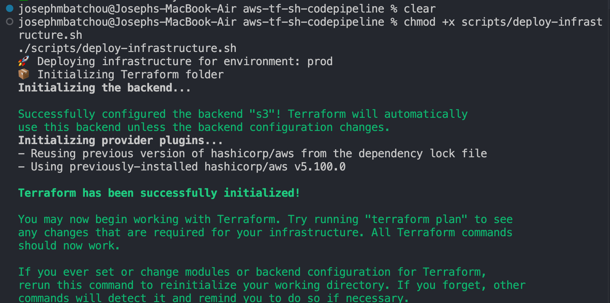

Terraform fmt and validate:


Terraform plan:
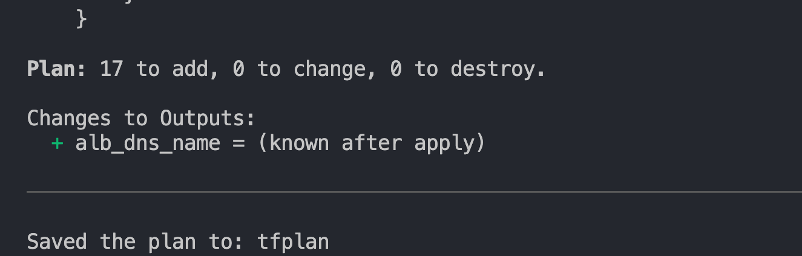

Terraform apply:
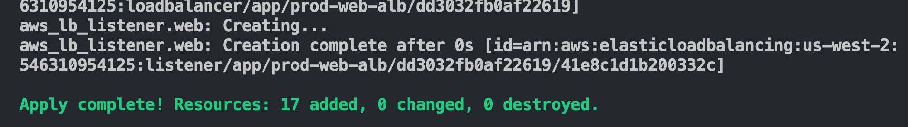

Terraform output:
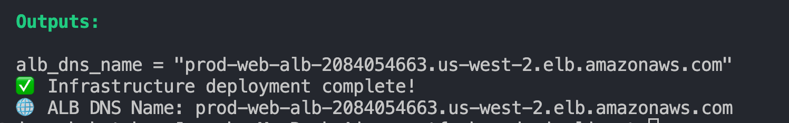

After copy the ELb dns in the output section you can go paste that in a new window on the browser and the web page will display.

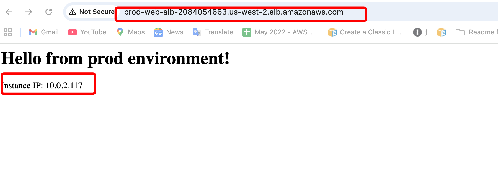

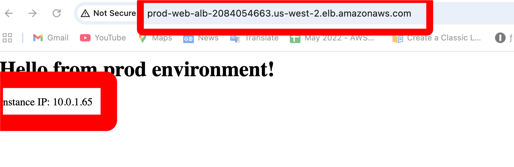

Run this command to make the codedeploy to take effect after any change committed

   ```bash
   chmod +x application/scripts/*.sh
   ./application/scripts/install_dependencies.sh
   ./application/scripts/start_server.sh
   ```

3.**Run Deployment Script of the pipeline**

   ```bash
   chmod +x application/scripts/*.sh
   chmod +x scripts/deploy-pipeline.sh
   ./scripts/deploy-pipeline.sh
   ```

The process will display following images:

Terraform init: 
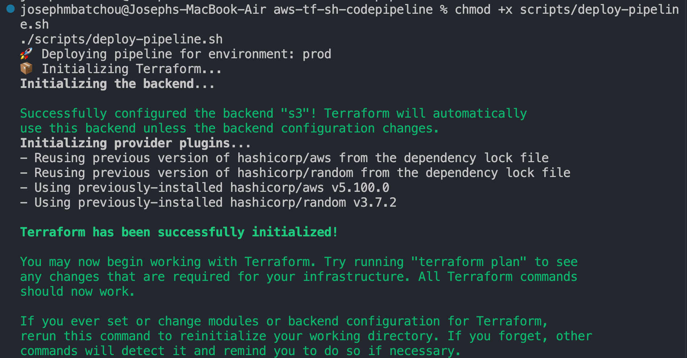

Terraform fmt and validate:
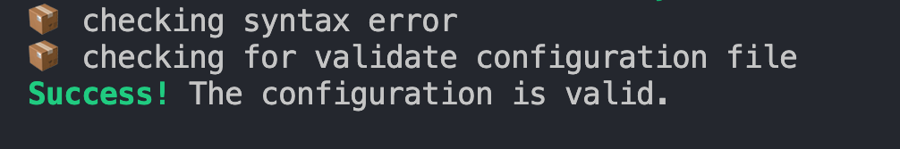

Terraform plan:
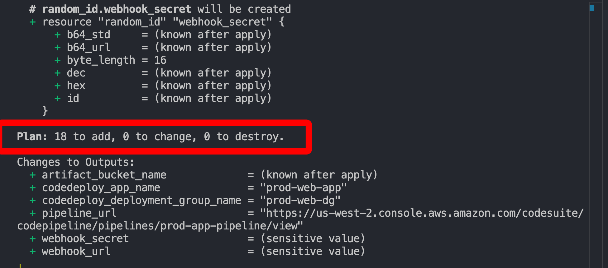

Terraform apply:
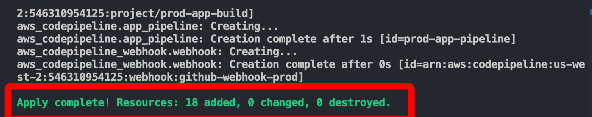

Terraform output:


Go in the console > Codepileline to see how the pipeline stages are running 


Make some changes in the index.html file save andpush it to githhub. Look at the codepipeline status. Then copy the ELb dns in the output section you can go paste that in a new window on the browser and the web page will display.


3.**Destroy pipeline (when done)**

  ```bash
   chmod +x scripts/destroy-pipeline.sh
   ./scripts/destroy-pipeline.sh
  ```

After typing or pasting the command you will get images

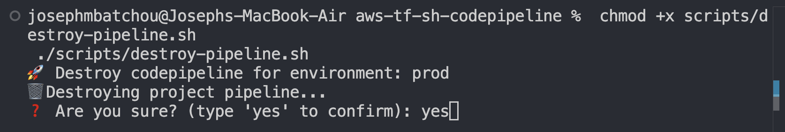
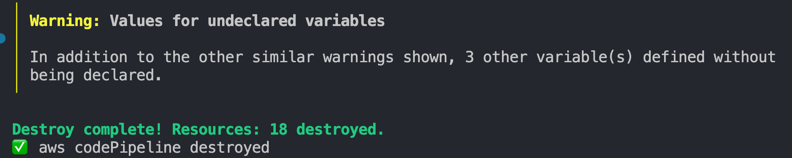

4.**Destroy Infrastructure (when done)**

  ```bash
   chmod +x scripts/destroy-infrastructure.sh
   ./scripts/destroy-infrastructure.sh
  ```

After typing or pasting the command you will get images


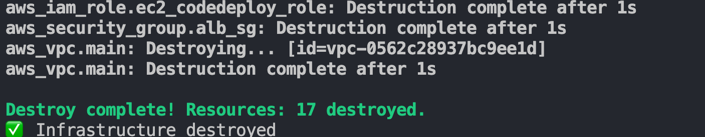

---

## 📌 Learning Outcomes

* Understand **Terraform basics** (providers, resources, state management)
* Automate deployments with **AWS Codepileline**
* Hands-on AWS infrastructure provisioning and automatic deployment 

---

## 🔗 Resources

* [Terraform AWS Provider Docs](https://registry.terraform.io/providers/hashicorp/aws/latest/docs)
* [Terraform CLI Docs](https://developer.hashicorp.com/terraform/cli)

---